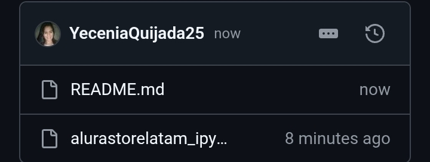

# AluraStore
Ayudar al Sr. Juan a decidir qué tienda de su cadena Alura Store debe vender para iniciar un nuevo emprendimiento. Para ello, analizarás datos de ventas, rendimiento y reseñas de las 4 tiendas de Alura Store. El objetivo es identificar la tienda menos eficiente y presentar una recomendación final basada en los datos.
<Para visualizar correctamente el informe debe seguir los siguientes pasos:>

Paso 1: Hacer click en el archivo alurastorelatam_jpy que se muestra en la siguiente imagen

Automáticamente se mostrará los dataset correspondientes a la facturación, los productos mas vendidos y menos vendidos, la calidixacion promedio por tienda, el costo promedio de envios y las gráficas

<src="3.jpg" alt="Imagen 2">

